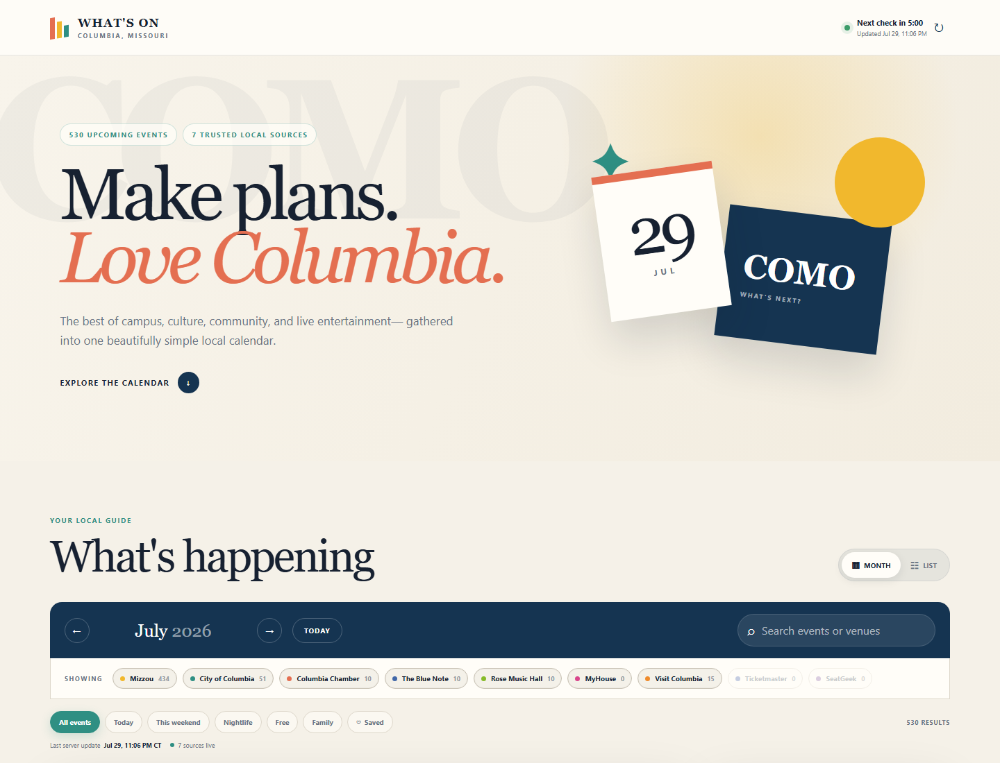

# What's On, Columbia

A source-transparent Vite + React month calendar for upcoming events in Columbia, Missouri.
The application combines civic, university, business, tourism, music, and
nightlife calendars into one normalized JSON cache. Visitors can filter by
source or interest, search, save events, export them, and open every event on
its original publisher's website.

## Live application

[https://whats-on-columbia.netlify.app/](https://whats-on-columbia.netlify.app/)



## What it includes

- Responsive month and list views
- Day agenda with title, local start time, venue, and original listing link
- Source toggles, quick filters, saved events, and text search
- Google Calendar and downloadable iCalendar actions
- America/Chicago timezone handling, including daylight-saving transitions
- Five-minute client polling with a persistent production cache
- Protected Vercel collector endpoint for scheduled upstream refreshes
- Source request/response samples under `docs/source-evidence/`
- No database and no client-side calls to third-party event websites

## Active data sources

| Source | Access | What it contributes |
| --- | --- | --- |
| [Mizzou Events](https://calendar.missouri.edu/) | Public LiveWhale JSON API | Campus talks, workshops, arts, and public university events |
| [City of Columbia](https://www.como.gov/CMS/webcal/) | Public iCalendar feed | Civic meetings, parks programs, and city community events |
| [Columbia Chamber](https://business.comochamber.com/events/searchscroll) | Public calendar HTML | Business, networking, ribbon-cutting, and community events |
| [The Blue Note](https://thebluenote.com/) | Official event cards | Concerts, comedy, dance nights, and parties |
| [Rose Music Hall](https://rosemusichall.com/) | Official event cards | Live music, outdoor shows, movies, and social events |
| [MyHouse](https://www.myhousecomo.com/) | Public Posh JSON feed | Nightclub and game-day events when published |
| [Visit Columbia](https://www.visitcolumbiamo.com/events/) | Official tourism calendar | Festivals, entertainment, nightlife, and visitor events |

Ticketmaster and SeatGeek adapters are also implemented. They activate when
their optional environment variables are supplied.

## Architecture

```text
Mizzou JSON ───────────┐
City iCalendar ────────┼─> scripts/fetch-events.mjs
Chamber calendar ──────┤       │
Ticketmaster (optional)┤       ├─ normalize timestamps and fields
SeatGeek (optional) ───┘       ├─ remove expired/cancelled events
                               ├─ deduplicate
                               └─ public/data/events.json
                                             │
                                             └─> React month calendar
```

The cache is committed intentionally in `src/data/events.json`; a public copy is
also written to `public/data/events.json`. That file is the deployment fallback.
On Netlify, a scheduled function collects fresh data every five minutes and
stores the normalized feed in Netlify Blobs. `/data/events.json` is rewritten to
a public feed function that reads the persistent store and falls back to the
bundled file if storage is temporarily unavailable. Refresh failures are
isolated by source, and the last generated cache remains deployable.

## Run locally

Prerequisites:

- Node.js 20.19 or newer
- npm

```bash
npm install
npm run refresh
npm run dev
```

While the site is open, the browser reloads `/data/events.json` every five
minutes. The header also offers a manual refresh control. In production, upstream
collection is performed only by the protected server endpoint; provider
credentials and scraping work are never exposed to the browser.

Open the local URL printed by Vite, normally `http://localhost:5173`.

To add the optional ticket providers:

```bash
cp .env.example .env.local
```

Then set:

```text
TICKETMASTER_API_KEY=...
SEATGEEK_CLIENT_ID=...
```

Never commit `.env.local`; it is ignored by Git.

## Netlify production refresh

The live application uses the configuration in `netlify.toml`:

- `netlify/functions/refresh-events.mjs` runs on `*/5 * * * *`.
- The collector writes the normalized result to a site-wide Netlify Blob.
- `netlify/functions/events.mjs` serves that Blob at `/data/events.json`.
- The committed JSON remains available as a fallback on the first deployment or
  during a temporary storage failure.

No API key, external scheduler, or database setup is required. Scheduled
functions run only for the published production deployment. To confirm the first
run immediately:

1. Open the site in Netlify.
2. Select **Functions**.
3. Select **refresh-events**.
4. Choose **Run now**.
5. Open
   [https://whats-on-columbia.netlify.app/data/events.json](https://whats-on-columbia.netlify.app/data/events.json)
   and verify that `generatedAt` is recent.

Netlify scheduled functions have a 30-second execution limit. The collector keeps
the last successful events from an individual source when that source is
temporarily unavailable.

## Validation

```bash
npm test
npm run build
npm audit
```

`npm run build` validates and bundles the JSX application into `dist/`. Tests
cover HTML cleanup, iCalendar parsing, deterministic identifiers,
cross-source deduplication, all-day and timed calendar exports, Netlify
fallback behavior, and Central Time conversion across daylight-saving changes.

## Refresh behavior

`npm run refresh` requests events from today through 180 days ahead. It:

1. Fetches each source independently.
2. Keeps Mizzou records with a physical location and removes virtual-only items.
3. Parses City of Columbia iCalendar data, including folded lines.
4. Reads structured timestamps from Chamber event cards and retrieves venue
   information from each original listing.
5. Reads official venue cards, the MyHouse JSON feed, and Visit Columbia detail
   pages.
6. Converts source records into one schema.
7. Removes expired and cancelled entries.
8. Deduplicates cross-source matches by normalized title, local date, start
   time, and venue while retaining separate same-day sessions.
9. Writes the cache and redacted evidence files.

The normalized schema is:

```json
{
  "id": "stable internal ID",
  "source": "Mizzou",
  "sourceId": "publisher ID",
  "title": "Event title",
  "start": "2026-08-07T13:15:00.000Z",
  "end": "2026-08-07T14:30:00.000Z",
  "allDay": false,
  "venue": "Venue name",
  "address": "Optional address",
  "url": "Original listing",
  "category": "Source category",
  "description": "Plain-text summary",
  "status": "active"
}
```

## Evidence and source decisions

- [`docs/SOURCES.md`](docs/SOURCES.md) explains what worked and what did not.
- [`docs/source-evidence/`](docs/source-evidence/) contains the request URL and
  sample response captured during the latest refresh.
- [`AI_LOG.md`](AI_LOG.md) records how AI was used and what required correction.

## Privacy and attribution

Only public event metadata is cached. Attendee, order, and personal information
is never requested. Event details remain attributable to their publishers, and
every card links to its original listing.
